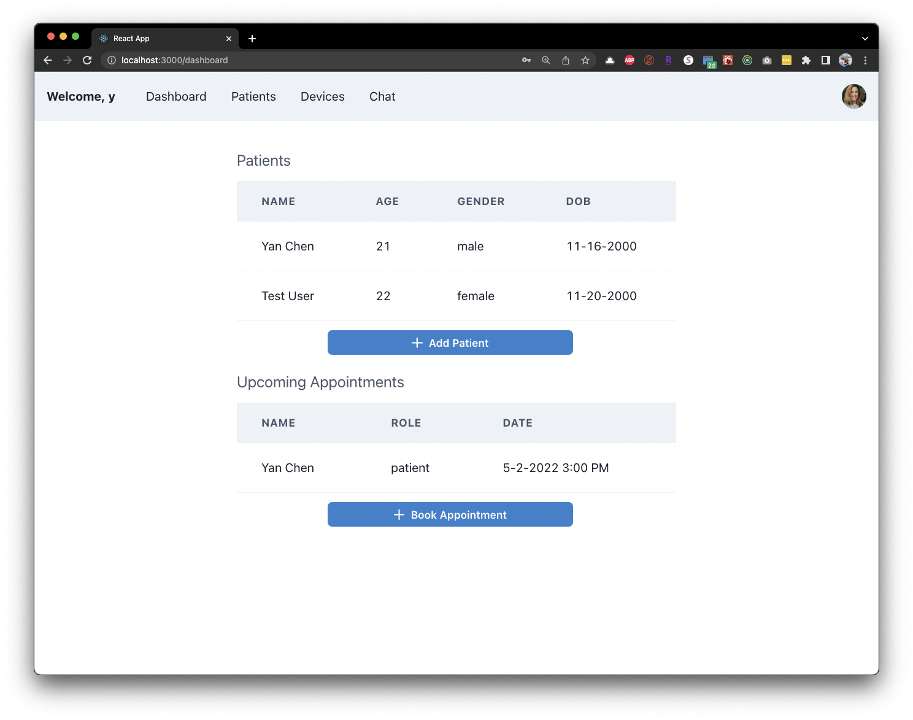

# Patient Management Platform


<!-- PROJECT LOGO -->
## About the Project
<div id="top"></div>
<br />
<div align="center">
<h3 align="center">Background</h3>
<p align="center">
The goal of this project is to build a medical platform that will allow medical professionals to monitor patients at home or at the hospital. In addition, patient's approved friends and family members can also use the platform to interact and monitor the patient's health status.
<br />
</p>
<h3 align="center">Concept</h3>
<p align="center">
The medical platform should allow multiple roles of personnel to interact with the platform, such as patients, medical professionals (nurses and doctors), administrators, and developers. The platform can provide these users with a smooth experience in monitoring and keeping record of patients' health status and medical history.
<br />
</p>
</div>
<p align="right">(<a href="#top">back to top</a>)</p>


<!-- TABLE OF CONTENTS -->
<details>
  <summary>Table of Contents</summary>
  <ol>
    <li>
      <a href="#about-the-project">About The Project</a>
    </li>
    <li>
      <a href="#user-stories">User Stories</a>
    </li>
    <li>
      <a href="#branch-strategy">Branching Strategy</a>
    </li>
    <li>
      <a href="#project-features">Project Features</a>
    </li>
    <li>
      <a href="#getting-started">Getting Started</a>
      <ul>
        <li><a href="#prerequisites-installation">Prerequisites Installation</a></li>
        <li><a href="#usage">Usage</a></li>
      </ul>
    </li>
  </ol>
</details>
<p align="right">(<a href="#top">back to top</a>)</p>


## User Stories
### Administrator User Stories
1. Add users to the system
2. Assign and change roles to users
    - Patient
    - Nurse
    - Doctor
    - Admin
    - Family member
3. A user can have many different roles, e.g.
    - A user can be a patient and/or a doctor
    - A user can be a family member and/or a patient
4. Provide interfaces to third party medical device makers to have their devices feed data to the system
5. Provide ability to disable or enable any device maker or application developer

### Medical Professional User Stories
1. Browse Patients
2. Assign a medical device to a Patient
3. Assign Alert and scheduling for medical measurement, e.g., Patient to measure blood pressure daily. MP will receive an alert if it not done. Temperature is higher or lower than a value. MP will get an alert if the measurement is outside acceptable range.
4. MP can input data for any patient
5. MP can chat with patients using text, voice or videos.
6. MP can read transcripts of Patient uploaded videos and messages
7. MP can search for keywords in messages and chats
8. MP have a calendar where they can show open time slots for appointments
9. MP can see all appointments booked at any time


### Patient Use Cases
1. Patient can enter measurement at any time
2. Patient can write a text or upload video or voice message to the MP
3. Patient can book an appointment with the MP
4. Patient can view their medical measurements

<p align="right">(<a href="#top">back to top</a>)</p>

<!-- Branch Strategy -->
## Demo

Appointments

https://user-images.githubusercontent.com/48025259/166163632-4b40f15d-829c-4dd6-a2bf-53f0b605c647.mp4


## Screenshots
<center></center>
<center>Landing Page</center>
<center></center>
<center>Sign Up Page</center>
<center></center>
<center>Sign In Page</center>
<center></center>
<center>Patient View Page</center>
<center></center>
<center>Start Chat Page</center>
<center></center>
<center>Chat Messages Page</center>
<center></center>
<center>Medical Professional View Page</center>


<!-- Branch Strategy -->
## Branch Strategy
Branch from `main` when developing a new feature/module. For example, if developing a `chat` module, then the newly created branch should be named as `chat/<feature>` branch. The feature branch will be merged to main/master branch upon completion of development, implementation, and unit test.

<p align="right">(<a href="#top">back to top</a>)</p>

<!-- Project Features -->
## Project Features
Backend
1. Device Module
2. Device Measurement Module
3. User Module
4. Chat Module (located in app.py) using SocketIO
5. Queue System for Async Processing with RabbitMQ
6. Speech to Text API

Frontend
1. Landing Page
2. Sign Up
3. Sign In
4. Dashboard for patient view
5. Dashboard for medica professional view
6. Book appointment feature
7. Real-time chat with any user


<p align="right">(<a href="#top">back to top</a>)</p>


<!-- GETTING STARTED -->
## Getting Started

Install dependencies in requirements.txt.  

The documentation to each module API is accessible at the homepage, which contains query param types, json body types.

### Prerequisites Installation
1. Install virtual env on your local machine
    - Windows User: python -m venv env
    - Mac User: python3 -m venv env
2. Enable virtual env
3. Install dependencies
    - Windows User:               
        ```sh
            pip install -r requirements.txt
        ```
    - Mac User:  
        ```sh
            pip3 install -r requirements.txt
        ```

<p align="right">(<a href="#top">back to top</a>)</p>


<!-- USAGE EXAMPLES -->
### Usage  
1. Install Docker & Docker-compose.
2. Run:  
    ```sh
        docker-compose up --build
    ```
    in the `/api` directory.
3. Install React dependencies:
    ```sh
        npm install
    ```
    in the `/portal` directory.
4. Then start React app with:
    ```sh
        npm start
    ```
    in the `/portal` directory.
5. Start the chat socketio server in `/chat-server` directory:
    ```sh
        npm start
    ```


<p align="right">(<a href="#top">back to top</a>)</p>


